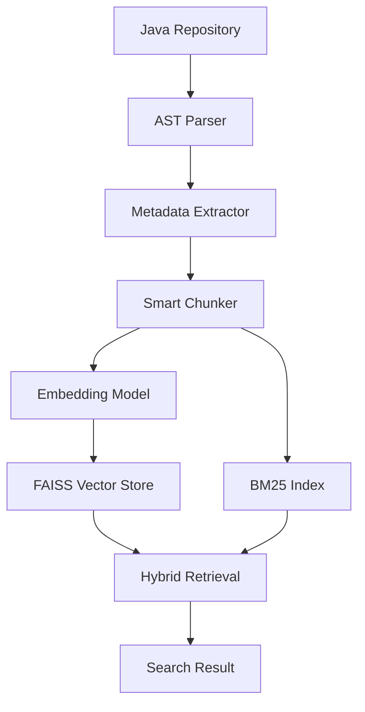
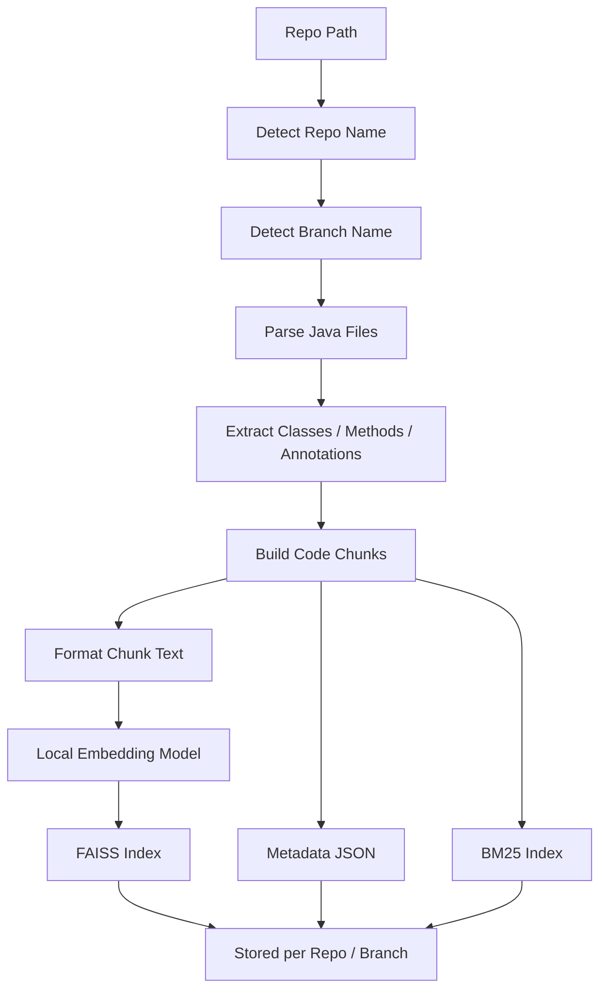
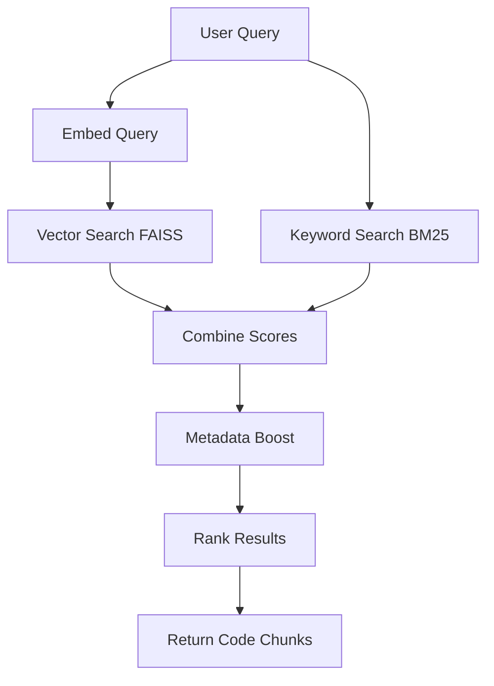
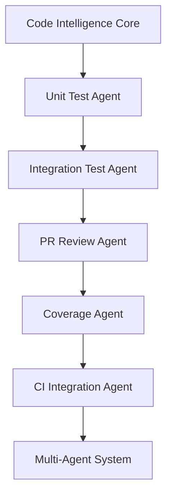
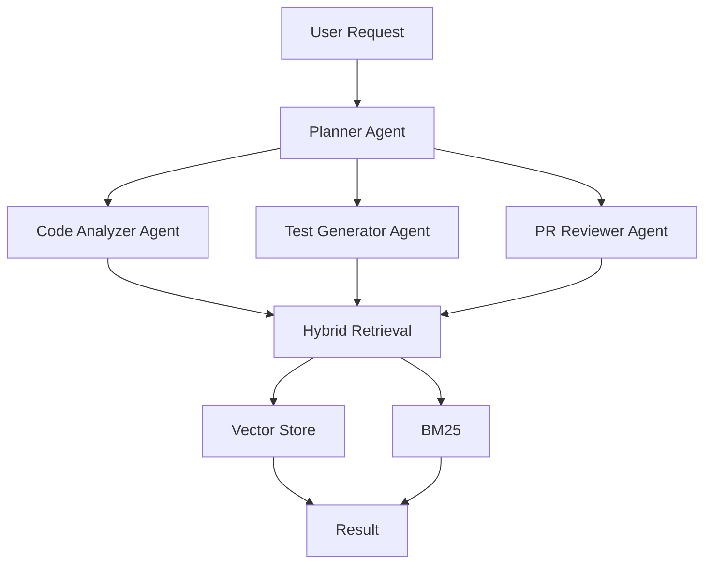

# agentic-code-intelligence

Agentic AI system for repository code intelligence, semantic indexing, and developer productivity.

This project builds a local-first AI system that can understand source code structure, perform semantic search, and assist developers by analyzing repository content using AST parsing, local embeddings, and hybrid retrieval.

The system is designed to work with real backend repositories and support future agentic features such as unit test generation, integration test suggestion, and PR review.


---

## Goals

The purpose of this project is to create an internal AI assistant that can:

- Understand Java / Spring Boot source code
- Index repository per branch
- Perform semantic + keyword search
- Understand custom annotations
- Provide context-aware retrieval
- Enable future agentic automation

Future capabilities:

- Unit test generation
- Integration test generation
- PR review assistant
- Coverage analysis
- CI integration
- Multi-agent orchestration


---

## Design Principles

- Privacy first
- Local embeddings only
- No external embedding API
- Structure-aware parsing
- Deterministic indexing
- Repo-aware storage
- Branch-aware storage
- Annotation-aware retrieval
- Modular architecture


---

## Technology Stack

- Python 3.11
- tree-sitter
- sentence-transformers
- FAISS
- rank-bm25
- Pydantic


---

## High Level Architecture



---

## Indexing Flow

This flow runs when indexing a repository branch.



---

## Retrieval Flow

This flow runs when searching code.



---

## Storage Layout

Index data is stored per repository and per branch.

```
data/
  {repo_name}/
    {branch_name}/
      faiss_index.bin
      metadata.json
```

Example:

```
data/point-of-sale-backend-engine/master/faiss_index.bin
data/point-of-sale-backend-engine/master/metadata.json

data/point-of-sale-backend-engine/feature_custom_food/faiss_index.bin
data/point-of-sale-backend-engine/feature_custom_food/metadata.json
```


---

## Annotation Registry

Custom annotations can be described in:

```
config/annotation_registry.json
```

Example:

```
{
  "AuditLog": "Marks method for audit logging",
  "BusinessFlow": "Defines business flow identifier",
  "InternalKafkaConsumer": "Consumes internal kafka topic"
}
```

This improves semantic embedding quality.


---

## Agentic AI Roadmap

This project is designed for multiphase agentic system.



Phase 1
- Code parsing
- Chunking
- Embedding
- Retrieval

Phase 2
- Unit test generation

Phase 3
- Integration test generation

Phase 4
- PR analysis

Phase 5
- Multi-agent orchestration


---

## Future Agent Flow



---

## Status

Phase 1 – Code Intelligence Core
Complete


---

## Purpose

This repository is intended for internal developer productivity tooling and experimentation with agentic AI for source code understanding.

Sensitive source code should remain inside approved environments.

---

## Tutorial — How to use Code Intelligence Core

This section explains how to use the Code Intelligence Core to index a repository and perform semantic search.

The current phase supports:

- Java repository parsing
- AST-based chunking
- Local embeddings
- FAISS vector storage
- BM25 keyword search
- Hybrid retrieval
- Repo-aware indexing
- Branch-aware indexing
- Annotation registry support


---

### 1. Install dependencies

Create virtual environment:

```
python3 -m venv venv
source venv/bin/activate
```

Install required packages:

```
pip install -r requirements.txt
```

This installs: `sentence-transformers`, `faiss-cpu`, `tree-sitter>=0.22`, `tree-sitter-java>=0.21`, `rank-bm25`, `pydantic>=2`, and `numpy`.


---

### 2. Prepare repository to index

Example repository:

```
/workspace/point-of-sale-backend-engine
```

Make sure repository is a git repo and has branch checked out.

Example:

```
git checkout feature/improvement-custom-food-ingridient
```


---

### 3. Optional — Configure annotation registry

Create file:

```
config/annotation_registry.json
```

Example:

```
{
  "AuditLog": "Marks method for audit logging",
  "BusinessFlow": "Defines business flow identifier",
  "InternalKafkaConsumer": "Consumes internal kafka topic",
  "CheckPermission": "Requires permission check"
}
```

This improves embedding quality for custom annotations.


---

### 4. Run indexing

Index with the default query:

```
python3 main.py /workspace/point-of-sale-backend-engine
```

Or provide a custom query to run after indexing:

```
python3 main.py /workspace/point-of-sale-backend-engine "Find payment service methods"
```

The system will:

1. Detect repo name and current git branch
2. Parse all `.java` files (skips `target/`, `build/`, `out/`, `.git/`)
3. Extract classes, methods, and annotations via AST
4. Build class and method chunks
5. Generate local embeddings (BAAI/bge-large-en-v1.5)
6. Save FAISS index and `metadata.json` per repo/branch
7. Build BM25 index in memory
8. Run hybrid search and print top 5 results


---

### 5. Storage result

Data will be stored automatically:

```
data/{repo_name}/{branch_name}/
```

Example:

```
data/point-of-sale-backend-engine/master/faiss_index.bin
data/point-of-sale-backend-engine/master/metadata.json

data/point-of-sale-backend-engine/feature_improvement_custom_food/faiss_index.bin
data/point-of-sale-backend-engine/feature_improvement_custom_food/metadata.json
```

Each branch has its own index.


---

### 6. Run search

After indexing, the system will run a sample query:

```
Find Kafka listener handling order events
```

Output example:

```
Repo: point-of-sale-backend-engine  Branch: master
Parsed files: 142
Total chunks: 891
Embedding shape: (891, 1024)
Saved FAISS index to data/point-of-sale-backend-engine/master/faiss_index.bin
Saved metadata to data/point-of-sale-backend-engine/master/metadata.json

Query: 'Find Kafka listener handling order events'

Top 5 results:

[1] score=0.8921
  file:        /workspace/.../OrderConsumer.java
  class:       OrderConsumer
  method:      handleOrderCreated
  annotations: KafkaListener, Transactional
  type:        method

[2] score=0.8104
  ...
```


---

### 7. Switching branch

If you change branch:

```
git checkout feature/improvement-add-on-beverage
```

Run indexing again:

```
python3 main.py /workspace/point-of-sale-backend-engine
```

New index will be stored in a different folder.

Old index will not be overwritten.


---

### 8. Re-index behavior

Current version rebuilds index for the branch.

Future version may support incremental indexing.


---

### 9. Expected usage in future phases

This Code Intelligence Core will be used by future agents:

- Unit test generator
- Integration test generator
- PR reviewer
- Coverage analyzer
- CI agent

All agents will use hybrid retrieval from this index.


---

### 10. Notes

- Embeddings run locally
- No source code sent to external API
- Safe for internal repository
- Supports custom annotations
- Supports multiple branches
- Supports multiple repositories